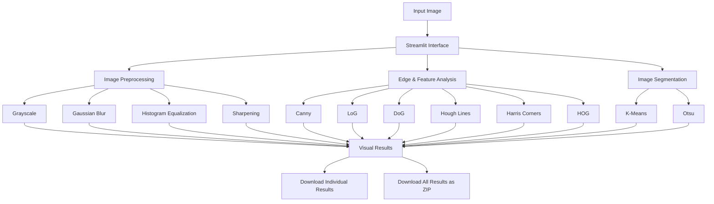

# Smart Vision Analyzer

> A modular computer-vision application built with **Python, OpenCV, NumPy, and Streamlit** for interactive image preprocessing, edge/feature analysis, and image segmentation.

## Academic Information

| Item | Details |
|---|---|
| **Student** | Swastik Pandey |
| **Registration Number** | 24BAI10957 |
| **Institution** | VIT Bhopal University |
| **Course** | CSE3010 – Computer Vision |
| **Project** | Smart Vision Analyzer |
| **Version** | V3 |

---

## Overview

**Smart Vision Analyzer** accepts an input image and applies classical computer-vision techniques through an interactive Streamlit interface.

The application is organized into three major modules:

1. **Image Preprocessing**
2. **Edge & Feature Analysis**
3. **Image Segmentation**

The interface also provides adjustable parameters, processing-time information, image statistics, explanations of the algorithms, and downloadable results.

---

## Key Features

- Interactive image upload
- Image resolution and channel information
- Grayscale conversion
- Gaussian filtering
- Histogram equalization
- Image sharpening
- Canny edge detection with adjustable thresholds
- Laplacian of Gaussian (LoG)
- Difference of Gaussian (DoG)
- Hough line detection
- Harris corner detection
- Histogram of Oriented Gradients (HOG)
- K-Means color segmentation with adjustable cluster count
- Otsu thresholding
- Processing-time measurement
- Algorithm explanations
- Individual result downloads
- Download-all-results ZIP export
- Input validation and error handling
- Pytest-based testing

---

## Computer Vision Modules

### 1. Image Preprocessing

Preprocessing improves or transforms the input image before further analysis.

| Technique | Purpose |
|---|---|
| **Grayscale** | Converts a color image into a single-channel intensity image |
| **Gaussian Blur** | Reduces noise and smooths the image |
| **Histogram Equalization** | Improves contrast distribution |
| **Sharpening** | Enhances image details and edges |

---

### 2. Edge & Feature Analysis

This module extracts important structures and features from the image.

| Technique | Purpose |
|---|---|
| **Canny** | Detects significant image edges |
| **LoG** | Combines Gaussian smoothing with Laplacian-based edge detection |
| **DoG** | Uses the difference between two Gaussian-smoothed images |
| **Hough Lines** | Detects prominent straight-line structures |
| **Harris Corners** | Detects corner-like regions |
| **HOG** | Represents local gradient orientations for feature description |

---

### 3. Image Segmentation

Segmentation separates an image into meaningful regions.

| Technique | Purpose |
|---|---|
| **K-Means** | Groups pixels into color/intensity clusters |
| **Otsu Thresholding** | Automatically selects a threshold for binary segmentation |

---

## Workflow



---

## Application Interface

The application provides three main tabs:

### Preprocessing
Contains grayscale conversion, Gaussian filtering, histogram equalization, and sharpening.

### Edges & Features
Contains Canny, LoG, DoG, Hough lines, Harris corners, and HOG analysis.

### Segmentation
Contains K-Means and Otsu segmentation.

The sidebar provides controls such as:

- Canny low threshold
- Canny high threshold
- Gaussian sigma
- K-Means cluster count

---

## Project Structure

```text
Smart-Vision-Analyzer/
│
├── app.py
├── requirements.txt
├── README.md
├── CHANGELOG.md
├── statement.md
├── pytest.ini
├── .gitignore
│
├── src/
│   ├── __init__.py
│   ├── preprocessing.py
│   ├── edges.py
│   ├── features.py
│   └── segmentation.py
│
├── tests/
│   └── test_modules.py
│
├── data/
│   └── README.txt
│
└── results/
    └── README.txt
```

---

## Technologies Used

- **Python**
- **OpenCV**
- **NumPy**
- **Streamlit**
- **Pytest**

OpenCV is pinned to `4.13.0.92` in `requirements.txt` because the project uses the OpenCV 4 Python API, including `cv2.HOGDescriptor`.

---

## Installation

### 1. Clone the repository

```bash
git clone https://github.com/swastik24bai10957-beep/Smart-Vision-Analyzer.git
cd Smart-Vision-Analyzer
```

### 2. Create a virtual environment

```bash
python -m venv venv
```

### 3. Activate the environment

**Windows PowerShell:**

```powershell
.\venv\Scripts\Activate.ps1
```

### 4. Install dependencies

```bash
python -m pip install -r requirements.txt
```

---

## Run the Application

Start Streamlit with:

```bash
streamlit run app.py
```

Open the local URL displayed in the terminal, usually:

```text
http://localhost:8501
```

---

## Testing

The project includes a `pytest.ini` configuration so that the `src` package is discovered automatically.

Run:

```bash
pytest -q
```

The test suite covers:

- Image preprocessing
- Edge detection
- HOG feature extraction
- Image segmentation
- Invalid parameter handling

---

## Results and Outputs

The application provides:

- Visual output for each implemented algorithm
- Processing-time information
- Image statistics
- Individual result downloads
- A ZIP file containing all generated results

The project is designed to make the effect of each computer-vision technique directly observable through the Streamlit interface.

---

## Academic Alignment

The project demonstrates classical computer-vision concepts including:

- Image preprocessing and filtering
- Edge detection
- Feature extraction
- Line detection
- Corner detection
- Gradient-based feature representation
- Image segmentation

These techniques provide a practical implementation of concepts studied in the **CSE3010 – Computer Vision** course.

---

## Design Goals

The project was developed with the following goals:

1. Provide an interactive interface for computer-vision experimentation.
2. Implement multiple classical computer-vision algorithms in a modular structure.
3. Keep individual algorithms separated into reusable Python modules.
4. Provide clear visual outputs for comparison and analysis.
5. Include automated tests for important processing functions.
6. Provide downloadable outputs for further analysis or documentation.

---

## Version History

See [`CHANGELOG.md`](CHANGELOG.md) for the project's version history and V3 improvements.

---

## Repository

**GitHub:**  
https://github.com/swastik24bai10957-beep/Smart-Vision-Analyzer

---

## Author

**Swastik Pandey**  
VIT Bhopal University  
CSE3010 – Computer Vision
